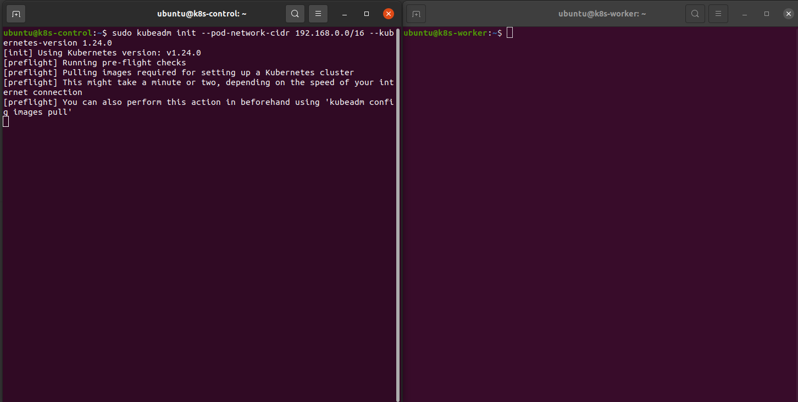

# LABORATORY-KUBERNETES

This repository is a little concentration of some information I want to keep about K8s. I have been training a lot for the CKA & CKS. I have learnt a lot of thing that could be really useful for me in the futur. For those who want to take the CKA too, I suggest you to be able to do the following if you want to pass it ;)

## How to setup a k8s cluster

<details><summary>How to setup a k8s cluster</summary>
This is a long tutorial of how I setup k8s on two EC2. I will create one control-plane node and one worker node.

Let's first setup the name of the host. It will be easier to know which terminal correspond to what.

```bash
$ sudo hostnamectl set-hostname k8s-control
$ sudo hostnamectl set-hostname k8s-worker
```


I add the name in the host file: /etc/hosts


The next step are basically written in the documentation:
[Containerd prerequisites](https://kubernetes.io/docs/setup/production-environment/container-runtimes/#forwarding-ipv4-and-letting-iptables-see-bridged-traffic)

The goal is to setup everything for installing the containerd

```bash
$ cat <<EOF | sudo tee /etc/modules-load.d/k8s.conf
overlay
br_netfilter
EOF
```


```bash
$ sudo modprobe overlay
$ sudo modprobe br_netfilter
```


```bash
$ cat <<EOF | sudo tee /etc/sysctl.d/k8s.conf
net.bridge.bridge-nf-call-iptables  = 1
net.bridge.bridge-nf-call-ip6tables = 1
net.ipv4.ip_forward                 = 1
EOF
```


```bash
$ sudo sysctl --system
```


Once done with the prerequisites, I install the containerd

```bash
$ sudo apt-get update && sudo apt-get install -y containerd
```


```bash
$ sudo mkdir -p /etc/containerd
$ sudo containerd config default | sudo tee /etc/containerd/config.toml
```


```bash
$ sudo systemctl restart containerd
$ sudo swapoff -a
```


I install the dependency for kubeadm:

```bash
$ sudo apt-get update && sudo apt-get install -y apt-transport-https curl
```


I now add the k8s repository to my list of repositories.

```bash
$ curl -s https://packages.cloud.google.com/apt/doc/apt-key.gpg | sudo apt-key add -
$ cat <<EOF | sudo tee /etc/apt/sources.list.d/kubernetes.list
deb https://apt.kubernetes.io/ kubernetes-xenial main
EOF
```


Update and install k8s.

```bash
$ sudo apt-get update
$ sudo apt-get install -y kubelet=1.24.0-00 kubeadm=1.24.0-00 kubectl=1.24.0-00
```


I lock the versions.

```bash
sudo apt-mark hold kubelet kubeadm kubectl
```

**IMPORTANT**: All this previous step has to be done on all the node that will be include to our cluster!


And finally, I initialize the cluster.

```bash
$ sudo kubeadm init --pod-network-cidr 192.168.0.0/16 --kubernetes-version 1.24.0
```



Last step for creating the control plane, just copy paste the command written at the end of the previous screen.

```bash
mkdir -p $HOME/.kube
sudo cp -i /etc/kubernetes/admin.conf $HOME/.kube/config
sudo chown $(id -u):$(id -g) $HOME/.kube/config
```


The control plane node is now available.


For enabling the communication between node, I will install the calico network add-on.

```bash
$ kubectl apply -f https://docs.projectcalico.org/manifests/calico.yaml
```


I use the kubeadm API to join a node to my cluster.

```bash
$ kubeadm token create --print-join-command
```


I copy and paste this command into my node.


And my two nodes are now availables.


</details>

## Commands

```bash
alias k=kubernetes
```

A list of interesting command to remember:

```bash
# Get all the context
$ k config get-context --no-headers

# Show the labels of every pods
$ k get pods --show-labels

# Get the pods and a particular colone
$ k get pods --no-headers | awk {'print $2'}

# Get the pods of every namespaces
$ k get pods -A

# Get everything in every namespaces
$ k get all -A

# Scale a deployment
$ k scale deploy <name> --replicas=X

# Create a pod in a yaml document
$ k run nginx --image nginx --labels=app=whatever,prod=2 --dry-run=client -o yaml > p.yaml

# Replace a resource by force
$ k replace --force -f /tmp/<name>

# Create a serviceaccount
$ k create sa <name> -n whatever

# Create a role
$ k -n whatever create role processor --resources=secrets,configmaps,pods --verbs=list,create

# create a rolebinding
$ k -n whatever create rolebinding processor --role processor --serviceaccount=whatever:processor

# Test a rolebinding
$ k -n ns2 auth can-i list secret --as system:serviceaccount:ns2:processor

# list resources
$ k api-resources

# List the containers
$ crictl ps

# logs a container
$ crictl logs

# Create a secret
$ k create secret generic secret2 --from-literal=user=user1

# Create a token for joining a node
$ kubeadm token create --print-join-command

# List the token
$ kubeadm token list
```

Useful commands:

```bash
# count lines
$ wc -l
```

## Links

- [Explanation maxSurge & maxUnavailable](https://www.bluematador.com/blog/kubernetes-deployments-rolling-update-configuration)
- [Example of questions](https://dev.to/subodev/50-questions-for-ckad-and-cka-exam-3bjm)
- [Guides](https://github.com/David-VTUK/CKA-StudyGuide/tree/master/LabGuide)
- [Killer.sh](https://www.youtube.com/watch?v=uUUwvPUcTBg)
